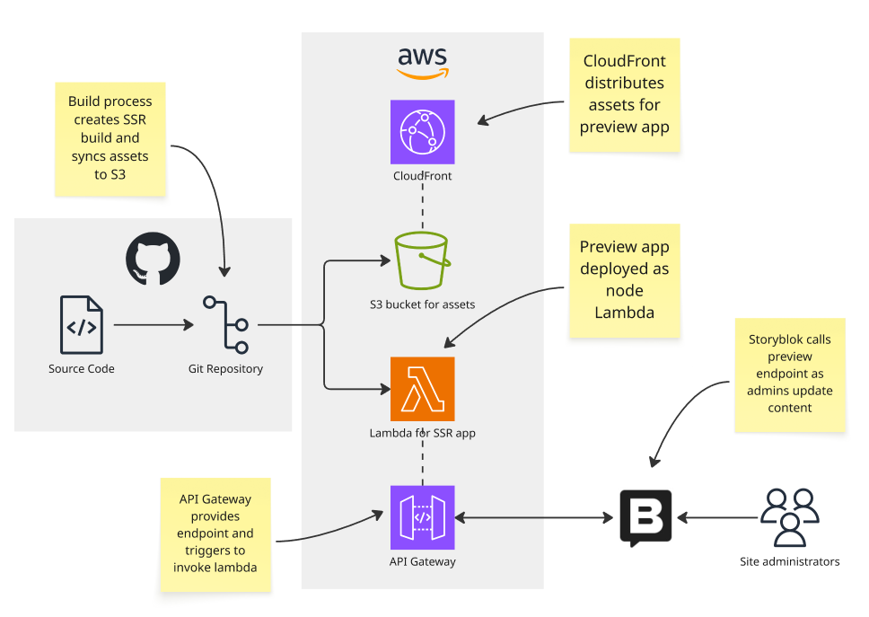

# CMS integration

This is the output of the [ONSPPT-275](https://anddigitaltransformation.atlassian.net/browse/ONSPPT-275) spike ticket to prototype and carry out initial design work to integrate the Storyblok Content Management System (CMS) with the application.

## Loading data

## Creating the preview

When content creators are uploading content using the Storyblok CMS, a preview of the site can be rendered within the Storyblok UI. This allows users to see how the site will be look when the content they are editing is rendered by the application. This preview should be able to update in real time based on the content being inputted.

As the application is [deployed as a static site](../architectural-decision-records/adr-7-deploy-as-a-static-site.md), this deployment method cannot be used to facilitate this preview as this requires client-side or server-side rendering (SSR) to update application content in real time. The application can be built using [Astro server-side rendering (SSR)](https://docs.astro.build/en/guides/on-demand-rendering/), but this requires a different deployment infrastructure. The application needs to be deployed as a function that can respond to requests from the user.

There are many different methods to deploy an Astro site as a SSR application. [AWS is already used](../architectural-decision-records/adr-4-use-aws-for-deploying-project-artifacts.md) to manage project infrastructure, and so we should use options available as part of AWS to deploy our SSR preview site. A combination of deploying the site as a [Lambda](https://aws.amazon.com/lambda/), managing static assets using [S3](https://aws.amazon.com/s3/) and [CloudFront](https://aws.amazon.com/cloudfront/) and handling requests using [API Gateway](https://aws.amazon.com/api-gateway/) was chosen. An image of this implementation is shown below.

This implementation was chosen for the following reasons:

- The CMS preview site will only be actively used when adminstrators are uploading content. Using a lambda to host the SSR site function means that the function will be using no compute resources and incurring no cost when idle
- Lambda functions are stateless, simplifying security and preventing session-related conflicts between multiple administrators
- The distribution of assets required for the preview site can be managed using existing S3 and CloudFront distributions. This follows an established pattern used to deploy the application as a static site, simplifying the infrastructure
- Deployment involves simply updating a ZIP file, fitting in with existing pipelines and authentication between Github and AWS
