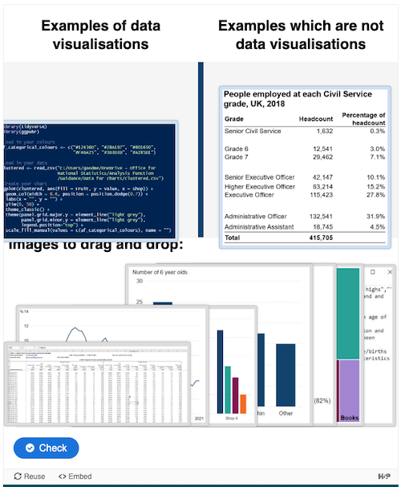

# Drag and drop component

This is the output of the [ONSPPT-361](https://anddigitaltransformation.atlassian.net/browse/ONSPPT-361) spike ticket to understand how we can implement a "drag and drop" component within unit content.

The intention for this component is that it will sit within a unit and allow a user to match questions to answers by "dragging and dropping" answers into boxes.

## Existing drag and drop examples

[What is data visualisation? – Government Analysis Function](https://analysisfunction.civilservice.gov.uk/support/communicating-analysis/introduction-to-data-visualisation-e-learning/data-visualisation-e-learning-module-1-what-is-data-visualisation/) uses a [h5p drag and drop component](https://h5p.org/tutorial-drag-and-drop-question#guides-header-2) wordpress plugin to render the exercise within an iframe on the page. An image of this implementation is shown below.

[Conjunctions Drag and Drop 2 – GrammarBank](https://www.grammarbank.com/conjunctions-worksheet-dd2.html) is more basic and just uses some simple javascript to allow users to drag and drop elements and performs conditional rendering of coloured elements based on text matching. There appear to be no dependencies with third party tools to do this.

## Accessibility considerations

The application must meet [WCAG2.2 AA accessibility requirements](../non-functional-requirements/accessibility.md#accessibility-1). [WCAG2.2 guidance docs](https://www.w3.org/WAI/WCAG22/Understanding/dragging-movements.html) suggest that in order to meet these requirements, the use of dragging should be avoided. Some people cannot perform dragging movements in a precise manner. Others use a specialized or adapted input device, such as a trackball, head pointer, eye-gaze system, or speech-controlled mouse emulator, which may make dragging cumbersome and error-prone.

The guidance suggests that if elements that include drag and drop functionality are to be included as part of an application, an alternative method must be provided so that users with mobility impairments who use a pointer (mouse, pen, or touch contact) can use the functionality. This alternative method must be in addition to any other method that involves using a keyboard, as people using a touch screen device may not use a physical keyboard.

[h5p documentation](https://help.h5p.com/hc/en-us/articles/7505649072797-Content-types-recommendations) suggests that the drag and drop component is "accessible", but does not reference which requirements it meets. The documentation states that these plugins do not guarantee any accessibility support. When using the drag and drop component, I was able to move images using single mouse clicks rather than dragging. This suggests that the component is meeting the WCAG2.2 AA guidelines on dragging movements. However, this component may not meet other accessibility requirements, particularly around [focused item visibility](https://www.w3.org/WAI/WCAG22/Understanding/focus-not-obscured-minimum.html).

There are plain text alternatives provided underneath the drag and drop as part of the Government Analysis Function page, which does ensure there is an alternative method even if this method is not interactive. So perhaps whilst the drag and drop component itself is not accessible, its use in conjunction with the plain text elements makes the page accessible overall.

## Integration with the application

The h5p drag and drop component used on the Government Analysis Function webpage uses a wordpress plugin to provide the component. There are no plugins available for h5p components for use with Storyblok or the Astro web framework. [h5p is made available as a SaaS subscription service](https://help.h5p.com/hc/en-us/articles/7633089307677-Getting-started). This would allow admin users to create interactive h5p components using the service, and then embed them into the application using an iframe.

## Recommendations

The best way to meet accessibility considerations would be to avoid using drag and drop components. It is suggested that the interactivity desired when using a drag and drop could be provided using a simple quiz that is easier to implement and to make accessible.

If the use of drag and drop components is required, the following recommendations are made:

- The h5p.com SaaS service should be used to provide these components. These components have been thoroughly tested and made as accessible as possible. Bespoke components for the application could be made, but the development time and cost to do this would be prohibitive
- Components provided by the h5p.com SaaS service should be embedded in the application using an iframe. This method has already been investigated to show [video content](./video-component.md) and can easily be extended to include other components like this with minimal development time required
- When drag and drop components are used, it may be appropriate to include additional methods and components to ensure content is still fully accessible
- The application accessibility statement should highlight that any h5p third party component integrations are not fully accessible, and detail the difficulties they add for users
