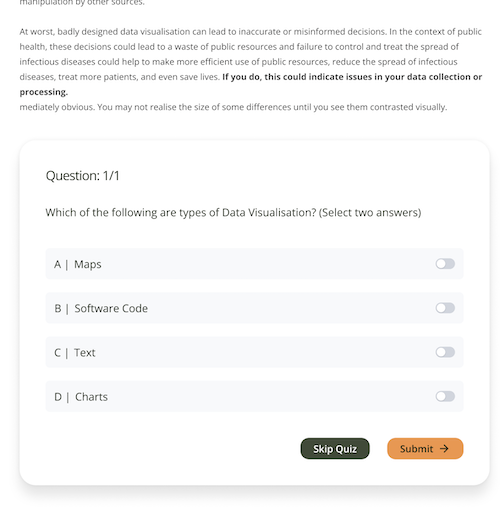

# Quiz component design

This is the output of the [ONSPPT-360](https://anddigitaltransformation.atlassian.net/browse/ONSPPT-360) spike ticket to investigate how we would implement a quiz component and include a recommended design. The questions this spike aims to answer are:

- What will a quiz look like, and how will it be used?
- Can an existing plugin be used for this quiz to cut down on development time?
- How would a component be built if we built it from scratch, and how would the quiz data be created in the CMS?

## What will a quiz look like, and how will it be used?

There is a requirement to provide a quiz that can be added as part of a unit to validate user learning. This quiz will be simple and will not require any user assessment or completion tracking \[[1]\]. It should also be fully accessible to meet project accessibility requirements \[[2]\]. An image of an initial design for this quiz is shown below.

Based on this initial design, the following requirements can be generated for a Quiz component:

- The Quiz component should be configured so it can be added to a Story on its own, or as an embedded component as part of a RichText field
- It should include at least one question, but could include multiple questions
- There should be a method to navigate through the list of questions. This should include the ability to navigate using the keyboard to ensure good accessibility
- Each question should include at least two potential answers, but may include multiple potential answers
- A question should include a rich text field so images or other content can be shown as part of the question
- A question may have a single correct answer, or multiple correct answers
- Each answer should have some help text that can be optionally displayed
- The quiz should feed back to the user whether they have answered the questions correctly or incorrectly. Colours may be used to do this but the primary feedback mechanism should be text to ensure good accessibility
- The quiz design and UX should match the existing application

## Can an existing plugin be used?

There are many third party options to create quizzes. Most are provided as part of a larger Learning Management System (LMS) or plugins for CMSs such as Wordpress. There are no existing quiz plugins available for Storyblok.

[react-quiz-component](https://github.com/wingkwong/react-quiz-component) is an open source react component package that provides quiz functionality. This could be used to render a quiz within the application, based on quiz content inputted into the CMS by an admin user. This package supports multiple question types, scoring, user feedback and is customizable. It is quite heavyweight however, and may take significant development time introduce application specific styling and integration with the data being returned by the Storyblok content API.

As the quiz is expected to be simple and will need to match the existing application design and UX, it is recommended that a custom component is created.

[1]: ../non-functional-requirements/usability.md#usability-1
[2]: ../non-functional-requirements/accessibility.md#accessibility-1
