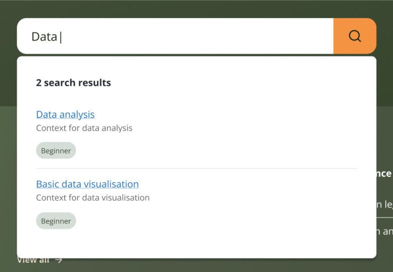

# Basic search design

This is the output of the [ONSPPT-298](https://anddigitaltransformation.atlassian.net/browse/ONSPPT-298) spike ticket to design how a simple and advanced search should be implemented.

We have already designed [how the site should be indexed](./search-design.md) using [pagefind](../architectural-decision-records/adr-14-use-pagefind-for-search.md). This spike includes how a simple and more advanced search should be implemented using this index.

A simple search will be provided as part of the homepage header and navbar. An image of the existing placeholder implementation is given below.

It is expected that users will use this simple search to quickly find content they are interested in.

## Search bar design requirements

- The search bar should include a text input field where users can type their search query
- The input should be accessible using the [search aria role](https://developer.mozilla.org/en-US/docs/Web/Accessibility/ARIA/Reference/Roles/search_role)
- Search should trigger on every change (onChange event) as the user types but may need to be [debounced](https://developer.mozilla.org/en-US/docs/Glossary/Debounce) to avoid excessive search api requests
- The term submitted for search via the api should match page names and tags in the index

## Search results list design requirements

- Each result item should be rendered as per the existing placeholder implementation and should include:
  - Page Title: Displayed as a clickable link navigating to the page
  - Page Summary: A short description of the page content
  - Page Tags: Display tags related to the page using the existing site `Tag` component
- When no matching results are returned from the api, a user-friendly message (e.g., "No pages found for 'search term'") should be displayed
- A loading indicator should be included if testing shows that the search api response is slow
- The search list does not need to paginate results, but it should be scrollable so all results can be viewed without the dropdown getting too large and obscuring the rest of the page
- Results should be ordered by relevance or whatever the default ordering is provided by the search api
