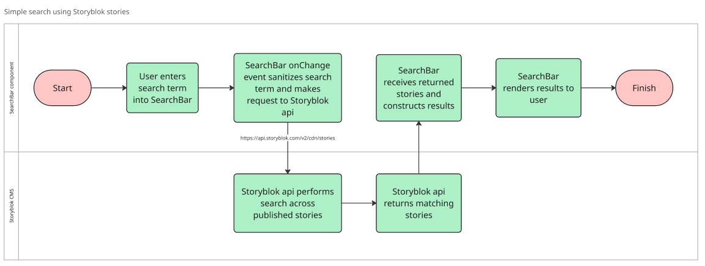
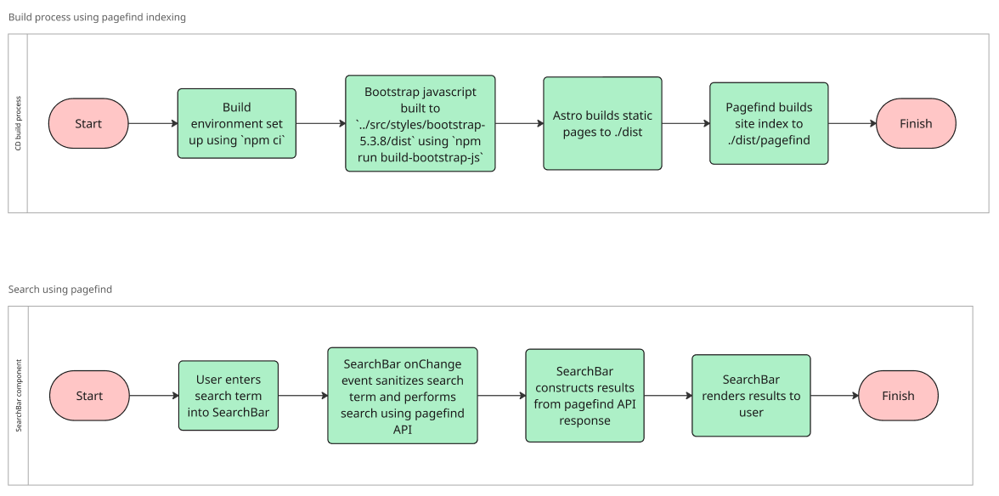

# Search design

This is the output of the [ONSPPT-266](https://anddigitaltransformation.atlassian.net/browse/ONSPPT-266) spike ticket to investigate how we would implement search across the site and include a recommended design.

There is a need for the application to provide search across the site. The questions this spike aims to answer are:

- What search functionality is required?
- What implementation options are available based on the architectural decisions taken so far?
- What is the recommended search implementation?

## What search functionality is required?

[Search non-functional requirements (NFRs)](../non-functional-requirements/search.md) have been written to capture the high-level search functionality the application requires. In summary, the search implementation should:

- Comprehensively index all content types (text, videos, interactive tools, code) and support multilingual content, ensuring scalability and frequent updates to reflect content changes
- Provide a fast, accurate, and user-friendly search experience, including keyword search
- Align with overall performance and usability goals, ensuring responsiveness and accessibility across all supported languages and conditions

Content structure and user needs when searching are not yet fully defined, so any search implementation should be extensible to ensure it meets future needs. Initial designs for a Search Bar [have already been implemented](https://github.com/ONSdigital/hid-pandemic-preparedness/pull/111). An image of this implementation is shown below.

## What implementation options are available?

The application technical architecture leads us to consider a number of implementations based on design descisions already made, particularly [using a headless CMS](../architectural-decision-records/adr-6-use-a-headless-cms.md), [deploying the application as a static site](../architectural-decision-records/adr-7-deploy-as-a-static-site.md) and [using the Astro web framework](../architectural-decision-records/adr-11-use-the-astrojs-web-framework.md).

### Simple search using the CMS API

The simplest implementation would be to use the headless CMS API to query the content using a search term inputted by the user. The response of this API call could then be used to construct search results. The image below shows an activity diagram of this implementation.

Whilst easy to implement, this solution has the following disadvantages:

- Could be slow as any search would involve a call to the CMS API and waiting for the response
- Could incur a significant number of calls to the CMS API, which are normally rate limited and often chargable once a limit has been reached
- Most CMS APIs offer limited search capability so would not be able to implement more complex searches
- Search results rendered client-side with no index created, so any results will not be crawlable by search engines and affect Search Engine Optimization (SEO)

### Static site search using Pagefind

[Pagefind](https://pagefind.app/) is a fully static search library that can crawl the application static site files at build time, creating a local search index in json format. This search index file is then deployed as part of the site and can be queried using the Pagefind API to return results.

When the CMS is integrated as part of the application, the application static site files will be built every time content is changed so it is published to the deployed site. By adding the pagefind local search index build as part of the build pipeline, a new index will be generated every time the site content changes. As the index file is hosted as part of the site itself, there are no calls to third-party APIs which could affect performance. This means no user data is sent to a third party either, increasing privacy. The image below shows an activity diagram of this implementation including how search would work from the page and how the index build would fit into the existing build process.

This solution meets a lot of the search requirements, but the additional step of building the index could increase build time. Whilst the pagefind search API is more feature rich than using the CMS API, it still lacks advanced features like semantic search or complex ranking.

### Search as a Service using AWS Opensearch

[Mangaged search services](https://en.wikipedia.org/wiki/Search_as_a_service) can be used to index the application static site and provide search results. Once static site files are built, the search service would index the content and store index files within the service. This services could then be queried via an API for search results.

Managed search services such as [AWS OpenSearch](https://aws.amazon.com/opensearch-service/) can handle large datasets and complex queries efficiently. They support advanced search features such as relevance ranking, fuzzy matching and filtering. They can be configured to update the index as often as is necessary, ensuring they remain aligned with the site content.

Whilst feature rich, this solution has the following disadvantages:

- Could be slow as any search would involve a call to the managed search service third-party API and waiting for the response
- Requires additional infrastructure setup, configuration, and ongoing maintenance
- Any managed search service will incur ongoing costs depending on usage and index size

## Recommendations

Following research into the different options above, it is recommended that [static site search using Pagefind](#static-site-search-using-pagefind) is chosen for the application search. This option is simple to set up and will provide search functionality required whilst still allowing the application to meet requirements around availability, performance and privacy. If project search requirements change significantly in future, this implementation could easily be swapped out for a more comprehensive managed search service such as AWS OpenSearch.

### Use the astro-pagefind integration

Using the [astro-pagefind](https://github.com/shishkin/astro-pagefind) integration creates the site pagefind index as part of the astro build process.

### Refine how often the static site files are indexed

By default the pagefind index would be generated every time the static site files change. This would be every time content changes and the CMS kicks off a new build process, which could be very frequent especially when content is being edited and refined. Building a new index will increase the time required and also the compute resourses needed for the site deployment pipeline. This could increase costs and also affect the meeting of [application sustainability requirements](../non-functional-requirements/sustainability.md).

The creation of the site index could be separated from the deployment pipeline and this index creation process could be run at a lower cadence, once a day for example. The execution of this process could also be timed to coincide with when compute costs are cheaper and greener using [demand shaping](https://learn.greensoftware.foundation/carbon-awareness/#demand-shaping). This would ensure any costs incurred by the site indexing are kept to a minimum.
